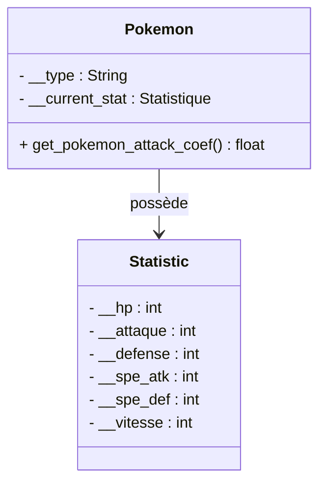
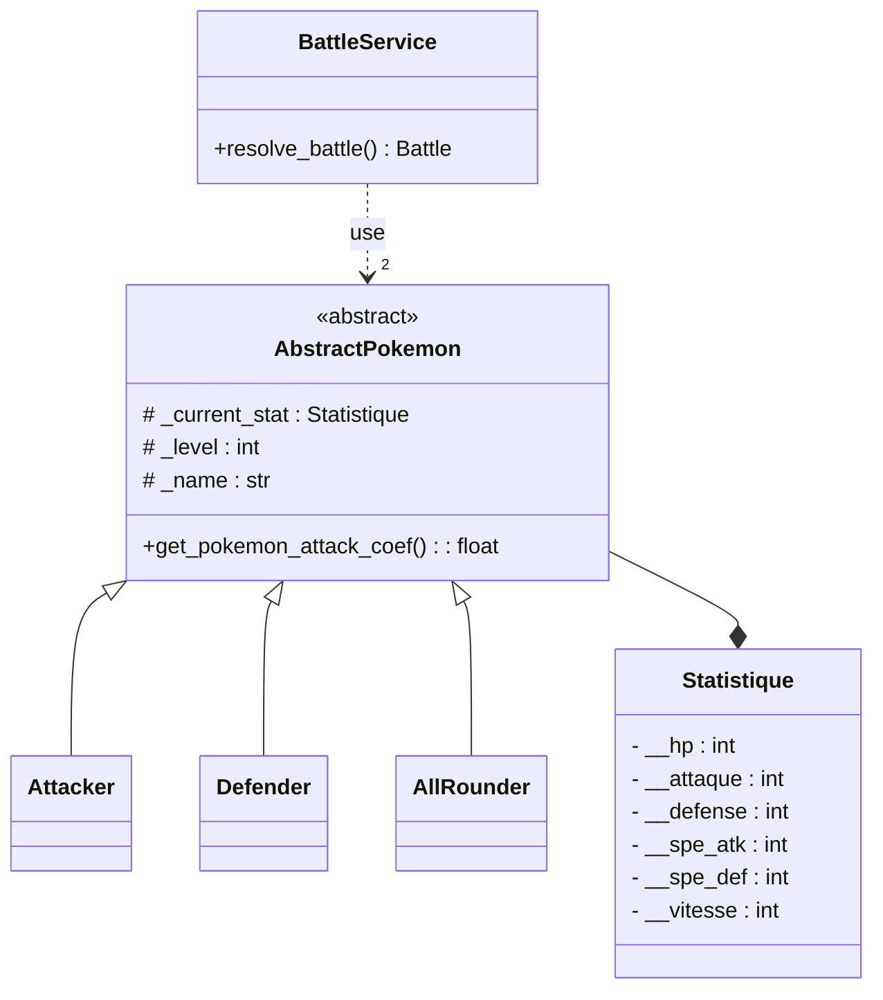
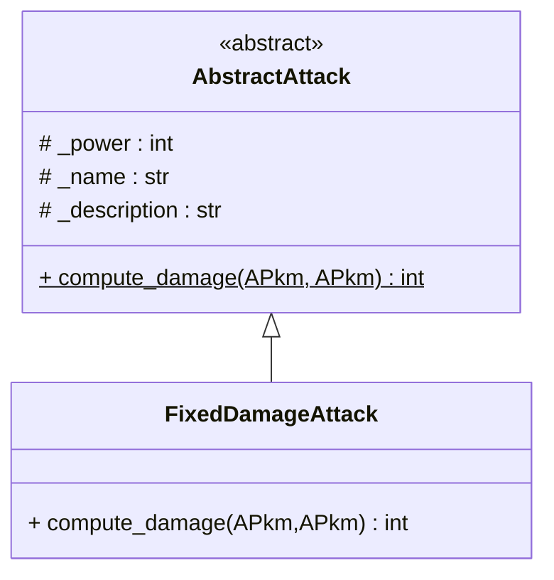
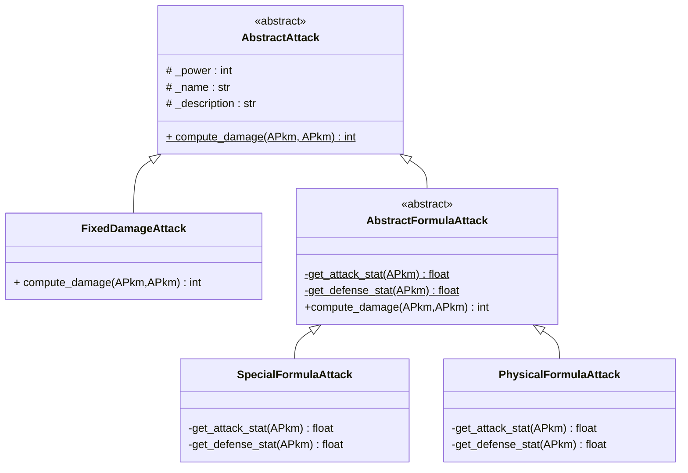
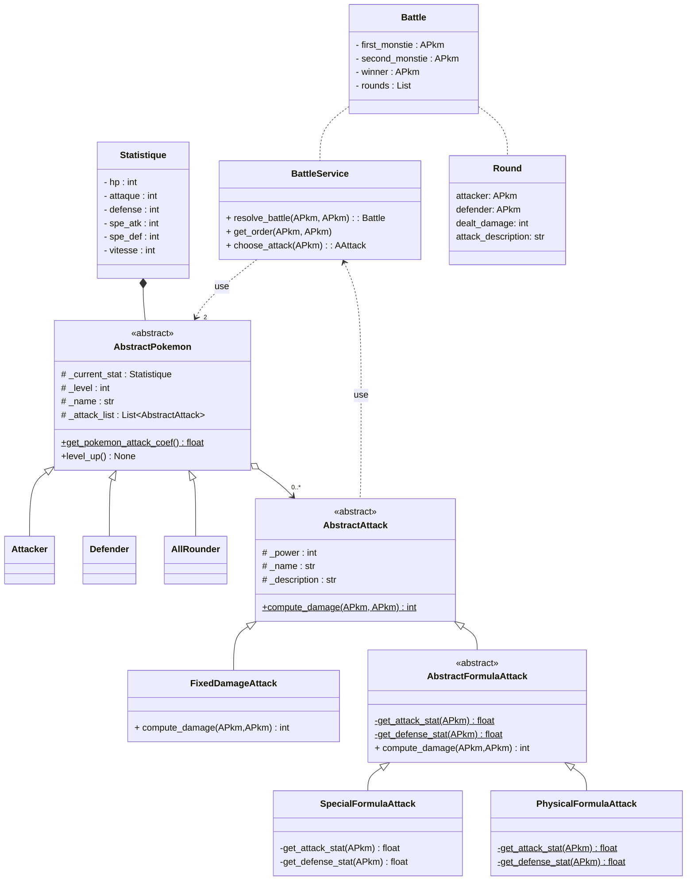

# TP 1 : Retour sur la POO, objets métier et patron de conception *strategy*

## :arrow_forward: 0. Avant de commencer

Ce TP mêle explications et phases de code.  

Les explications de ce TP ne doivent pas prendre le pas sur celles de votre intervenant. Prenez les comme une base de connaissance pour plus tard, mais préférez toujours les explications orales.

---

## :arrow_forward: 1. Introduction et mise en place

Vous allez créer les **objets métier** pour un jeu *Pokémon*.  
Un objet métier représente dans votre code quelque chose de concret, qui modèlise la réalité.

> **Objet métier (business object)** : représentation informatique d'un objet "réel" que notre programme va manipuler pour répondre à un besoin. Dans le cas de notre application cela sera des *Pokémons*, des attaques ou des objets.  
> Dans une application de e-commerce par exemple, les articles et comptes sont des objets métier. Ils permettent de séparer les données de l'application et les traitements. Cela conduit à avoir des objets contenant essentiellement des attributs et très peu de méthodes autre que des *getter* et *setter*.

Ce TP sera réalisé avec l'IDE (**I**ntegred **D**evelopment **E**nvironment) `Visual Studio Code`.

### :small_orange_diamond: Importez le code du TP

* Ouvrez **Git Bash**
* Créez un dossier pour stocker le code du TP
  * par exemple, copiez la ligne ci-dessous, puis collez là dans Git Bash (clic droit > Paste)
  * `mkdir -p /p/Cours2A/UE3_Complements_informatique/TP/TP1 && cd $_`
* Clonez le dépôt
  * `git clone https://github.com/ludo2ne/ENSAI-2A-complement-info-TP.git`
* Ouvrez **Visual Studio Code**
  * File > Open Folder
    * Aller dans `/p/Cours2A/UE3_Complements_informatique/TP/TP1/` (ou dans le dossier où se situe le dépôt que vous venez de cloner)
    * cliquer sur  `ENSAI-2A-complement-info-TP`, puis sur le bouton **Sélectionner un dossier**

Lisez le fichier `README.md` et suivez les instructions.
Puis lancez le programme **__main__.py** pour vous assurer que tout fonctionne correctement.

* Ouvrez un terminal dans VSCode (CTRL + ù)
  * c'est le même terminal **Git Bash** que vous avez ouvert au début
  * mais c'est plus pratique d'avoir tout au même endroit
* listez les branches `git branch -a`

Vous avez la possibilité de consulter la correction en changeant de branche si et seulement si vous êtes bloqué trop longtemps.  
Voici quelques commandes git utiles :

```git
# Avant de changer de branches, créez un point de sauvegarde de votre travail
git add .
git commit -am "<message>"

# changer de branche
git checkout <nouvelle_branche>      # dans le terminal, la branche courante est indiquéée entre ()
git checkout -                       # pour retourner à la branche précédente
```

---

### :small_orange_diamond: Ce que vous allez coder

Notre jeu s'inspirera de *Pokémon Unite* (aucune connaissance du jeu, ni de *Pokémon* n'est nécessaire).  
Pour résumer en quelques mots, voici les objets que nous allons manipuler :

* `Pokemon` : qui ont diverses caractéristiques et statistiques
  * hp : health points
  * attack, defense, speed... : qui serviront déterminer la force de ses attaques
  * un type : [Attacker, Defender, All Rounder, Speedster, Supporter](https://www.ationhive.com/fr/jeux/pokemon-unite/guide/roles-des-pokemon)
* `Statistic` : pour éviter de surcharger la classe `Pokemon`, de nombreuses stats sont stockées dans un objet de la classe `Statistic`
* `Attack` : différents types d'attaques dont disposeront les Pokémons (partie 3)
* `BattleService` : servira à faire s'affronter 2 Pokémons pour déterminer l'issue du combat (partie 4)

---

## :arrow_forward: 2. Modélisation et implémentation

> Dans un premier temps, nous allons coder uniquement les `Pokemons` (la classe `Statistic` est déjà codée).
> En fonction de son type, son coefficient d'attaque dépendra de diverses statistiques.



Avant d'écrire du code, nous allons réfléchir à la meilleure conception possible pour réaliser nos Pokémons. Notre conception essaiera au maximum de respecter la règle suivante : **faible couplage, forte cohésion**.  

En d'autre termes nous allons essayer de faire :

* des classes **les plus disjointes possible** (*faible couplage*) pour qu'une modification dans une classe ne nous demande pas de modifier les autres
* tout en essayant d'avoir **les tâches réalisées par une seule classe les plus liées possible** (*forte cohésion*).

### :small_orange_diamond: Première approche : le « `if/elif/else` » :skull:

Ouvrez le code, et observez la classe `Pokemon`. Nous nous interessons à la méthode `get_pokemon_attack_coef()` qui va servir à déterminer la puissance de l'attaque en fonction du type de *Pokémon*.

> * [ ] **Question 1 :** Expliquez pourquoi une implémentation à base de `if/elif/else` pour les types est une mauvaise idée ? Imaginez s'il y avait plusieurs blocs de code similaires dans notre application, et que nous devions ajouter un nouveau type.

---

### :small_orange_diamond: La puissance de la POO

Au lieu d'externaliser les comportements de nos *Pokémons*, nous allons mettre tous leurs comportements spécifiques dans des classes filles d'une super classe `Pokemon`. Ceci est rendu possible grâce à deux propriétés des objets en POO :

* **héritage** : il est possible de spécialiser une classe existante en modifiant son comportement, ou en ajoutant de nouveaux
* **polymorphisme** : deux fonctions peuvent avoir le même nom mais avoir des comportements différents

En plus, comme chacun de nos *Pokémons* va forcement être d'un type, aucun ne sera simplement de la classe `Pokemon`, cela nous permet de rendre cette classe *abstraite*. En définissant clairement notre classe abstraite nous allons avoir :

* Un plan pour toutes les classes qui en héritent. Cela à pour avantages de :
  * Donner des informations sur la structuration du code  
  * Permettre de générer automatiquement les méthodes à définir
  * Limiter les bug. Si on oublie une méthode, le code plante au démarrage, ce qui évite des comportements non prévus difficile à détecter
* Une **interface** unique pour tous les types de *Pokémons*. Quelque soit le type du *Pokémon*, il sera considéré comme un `AbstractPokemon` partout dans le code.

---

> * [ ] **Question 2** :
>   * [ ] transformez la classe `Pokemon` en classe abstraite `AbstractPokemon`
>     * renommez également le fichier en `abstract_pokemon.py`
>   * [ ] transformez la méthode `get_pokemon_attack_coef()` en méthode abstraite
>   * [ ] créez les classes `Attacker`, `Defender` et `AllRounder` qui héritent de `AbstractPokemon`
>   * [ ] dans ces 3 classes, implémentez la méthode `get_pokemon_attack_coef()`

Pour vous aider, voici le diagramme de classe :



Vous devriez arriver à une arborescence proche de celle-ci :

```
📦pokemon_unite_lite
 ┣ 📂business_object
 ┃ ┣ 📂pokemon
 ┃ ┃ ┣ 📜abstract_pokemon.py
 ┃ ┃ ┣ 📜attacker.py
 ┃ ┃ ┣ 📜defender.py
 ┃ ┃ ┗ 📜all_rounder.py
 ┃ ┗ 📜 statistique.py
 ┗ 📂service
   ┗ 📜battle_service.py
```

Pour faire une classe abstraite, utilisez le package `abc`.  
Voici, pour vous inspirer, un exemple de ce qui est attendu :

```python
# Fichier abstract_personnage.py
from abc import ABC, abstractmethod

class AbstractPersonnage(ABC):
    def __init__(self, phrase_attaque:str, phrase_defense:str) -> None:
        self._phrase_attaque = phrase_attaque
        self._phrase_defense = phrase_defense
       
    @abstractmethod # décorateur qui définit une méthode comme abstraite
    def degat_attaque(self) -> int:
     pass

# Fichier magicien.py
from abstract_personnage import AbstractPersonnage
class Magicien(AbstractPersonnage):
    def __init__(self) -> None:
        super().__init__("Lance une boule de feu","Utilise une barrière magique" )
       
    def degat_attaque(self) -> int:
        # code pour calculer les dégâts
        return 10
```

### :small_orange_diamond: Testez votre code

> * [ ] **Question 3** : Testez la méthode `get_pokemon_attack_coef()` pour les classes `AttackerPokemon` et `AllRounderPokemon`.  
> Pour lancer tous les tests du projet, exécutez dans le terminal : `python -m unittest`

Pour cela vous allez utiliser le package `unittest` de python.  

Ce package permet de réaliser des tests unitaires dans des classes séparées. L'avantage par rapport à `doctest`, c'est que les tests ne "polluent" pas vos classes, et qu'il est possible de *patcher* certains comportements des classes.  

Un exemple de test est donné dans la classe `testDefenderPokemon`. Pour rappel, un test se décompose en 3 parties :

* **GIVEN** : création des objets nécessaires à la réalisation du test
* **WHEN** : appel de la méthode à tester
* **THEN** : vérification du résultat

Les classes de test seront organisées de la manière suivante, en reproduisant l'architecture de votre application :

```
📦pokemon_unite_lite
 ┣ 📂business_object
 ┃ ┣ 📂pokemon
 ┃ ┃ ┣ 📜abstract_pokemon.py
 ┃ ┃ ┣ 📜attacker.py
 ┃ ┃ ┣ 📜defender.py
 ┃ ┃ ┗ 📜all_rounder.py
 ┃ ┗ 📜 statistique.py
 ┣ 📂service
 ┃ ┗ 📜battle_service.py
 ┗ 📂test
  ┗ 📂test_business_object
      ┗ 📂test_pokemon
        ┣ 📜test_abstract_pokemon.py
        ┣ 📜test_attacker_pokemon.py
        ┣ 📜test_defender_pokemon.py
        ┗ 📜test_all_rounder_pokemon.py
```

> * [ ] **Question 4** : Pouvez-vous tester la méthode `level_up()` directement sur un `AbstractPokemon` ? Avez vous une idée comment faire ? (ne pas coder cette question)

---

## :arrow_forward: 3. L'agrégation, l'autre façon d'ajouter de la souplesse dans le code

Maintenant que nos Pokémons sont faits, nous allons y ajouter les attaques.  

Notre système va devoir respecter certaines contraintes :

* Plusieurs types d'attaques vont coexister, chacune avec un mode de calcul de dégâts différent :
  * Des attaques  à dégâts variables séparées en 2 types :
    * attaques "physiques" qui utilisent l'attaque et la défense des Pokémons
    * attaques "spéciales" qui utilisent l'attaque spé et la défense spé des Pokémons
  * Des attaques à dégâts fixes qui font un nombre fixe de dégâts.
* Un pokémon peut avoir plusieurs attaques et le type de l'attaque doit être transparent pour le pokémon.

---

### :small_orange_diamond: Attaques à dégâts fixes

Nous allons commencer par les attaques à dégâts fixes. Comme il y aura un autre type d'attaques, toutes les attaques hériterons de la classe abstraite `AbstractAttack` déjà créée. Cette classe possède la méthode abstraite `compute_damage()` qui devra être implémentée dans les classes filles.



> * [ ] **Question 5** Implémentez la classe `FixedDamageAttack`, ainsi que sa méthode `compute_damage()` qui retournera simplement la puissance (*power*) de l'attaque.  
> Créez des tests pour vérifier que tout fonctionne correctement.

---

### :small_orange_diamond: Attaques à dégâts variables

Nous allons ensuite coder les attaques à dégâts variables. Elles utilisent la formule suivante :
$Damage = \big ( \frac{(\frac{2*Level}{5}+2)* Power *Att}{Def*50} +2\big) *random* other\_multipliers$

avec :

* $Att$​ : égal soit à l'attaque ou l'attaque spé du Pokemon attaquant
* $Def$​​ : égal soit à la défense ou défense spé du Pokemon défenseur
* $Power$​ : la valeur de puissance de l'attaque
* $random$​​ :une valeur comprise dans l'intervalle [0.85; 1]
* $other\_multipliers$​​ : les autres multiplicateurs possible, comme le coefficient d'attaque des pokémons.

La seule différence entre attaque physique et spéciale vient des coefficients $Att$ et $Def$, le reste de la formule des dégâts est identique. Nous allons donc utiliser le patron de conception *template method*, dont voici la modélisation UML dans notre cas :



La classe `AbstractFormulaAttack` va contenir :

* la méthode `compute_damage(pkmon_attacker: AbstratPokemon, pkmon_targeted: AbstractPokemon)`. Cette méthode va contenir la formule de calcul des dégâts, mais en appelant les méthodes  `get_attaque_stat(AbstractPokemon)` et `get_defense_stat(AbstractPokemon)` pour savoir quelle statistique utiliser
* les méthodes abstraites `get_attack_stat(AbstractPokemon)` et `get_defense_stat(AbstractPokemon)`. Ces méthodes devront être implémentées dans les classes filles pour déterminer quelles statistiques utiliser.

> * [ ] **Question 6** : Implémentez les 3 nouvelles classes et créez des tests pour vérifier que tout fonctionne correctement

---

## :arrow_forward: 4. Architecture finale (bonus, si vous avez le temps)

Nous allons maintenant rattacher les bouts pour créer notre architecture finale :



> * [ ] **Question 7** : Implémentez le diagramme de classe ci-dessus et testez votre code en écrivant de nouveaux tests unitaires.

Cette architecture permet de décorréler les attaques des pokémons et de spécifier le comportement des attaques au fur et à mesure des héritages. Les avantages sont :

* Pour la classe `AbstractPokemon`, toutes les attaques sont des `AbstractAttack`. Tant qu'elles exposent la méthode `compute_damage` notre programme va fonctionner. On peut ainsi facilement ajouter de nouveaux types d'attaques sans problème.
* Un *Pokémon* peut avoir des attaques de tous les types
* Nous pouvons ajouter un système d'état comme la paralysie ou le poison assez facilement. Il faut pour cela modifier la classe `AbstractAttack` et les classes qui en héritent. Cela sera potentiellement long, mais ne demande pas de toucher à la partie "*Pokémon*" de notre architecture.
* Une personne pourrait se concentrer sur la création des *Pokémons* alors qu'une autre pourrait se concentrer sur celles des attaques sans difficulté. Les deux parties du code sont relativement indépendantes, la seule zone de couplage sont les classes `AbstractPokemon` et `AbstractAttack`, qui servent avant tout à définir ce qui doit être fait par les classes filles et ce qui est accessible à l'extérieur.

Le fait d'externaliser le comportement des attaques dans des classes spécifiques puis de les lier aux Pokémons via une relation d'agrégation assez souple qui permet de changer dynamiquement les attaques d'un Pokémon est le patron de conception *strategy*.
