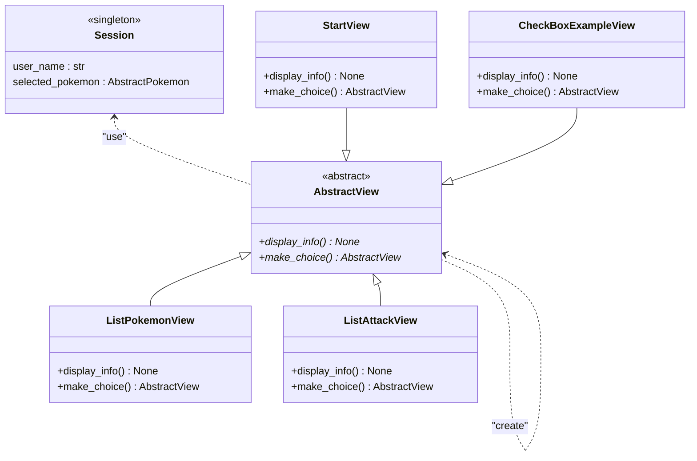

# TP 4 - Git et Création d'une IMH (interface homme machine)

> :scream: Comme vous pouvez le constater le sujet de ce TP est lui aussi long. Cela ne doit pas vous effrayer. Il mélange explications complètes et manipulations pour être au maximum autosuffisant. **Vous n'allez surement pas terminer le sujet, ce n'est pas grave. Il est là pour vous aider lors du projet informatique.**
>
> :exclamation: Il est possible que les copiés/collés fonctionnent étrangement (caractère de fin de ligne qui disparaissent, indentation qui change). Faites-y attention !
>
> Ce TP mêle explications pour vous faire comprendre ce qui est fait, et phase de manipulation ou code. Ces phases sont appelées "**:writing_hand:Hands on**". C'est à ce moment-là que vous devez faire ce qui est écrit dans le TP. Les explications de ce TP ne doivent pas prendre le pas sur celles de votre intervenant. Prenez-les comme une base de connaissance pour plus tard, mais préférez toujours les explications orales, surtout pour poser des questions.

Dans ce TP vous allez :

- Faire vos premières classes qui gèrent l'affichage
- Manipuler plus en détails git

> :warning: Toutes les commandes git doivent être saisies dans un terminal !

Je vous conseille de vous référer à la [cheatsheet](https://foad-moodle.ensai.fr/pluginfile.php/6195/mod_resource/content/2/github-git-cheat-sheet.pdf) git disponible sur Moodle (les commandes les plus importantes sont surlignées) pour avoir les commandes git sous les yeux

## Travail en groupe et git 🧙‍♂️👩‍🔬🕵️‍♂️🦸‍♀️💻

Cette partie part du principe que vous utilisez gitlab comme dépôt git. Ce n'est pas obligatoire, mais si vous utilisez autre chose vous devez agir en autonomie.

### Création de compte sur gitlab et setup

Chaque étudiant doit se créer un compte sur gitlab :  https://about.gitlab.com/ > `Register`.

Récupérez le fichier `setup` disponible sur Moodle en fonction de la machine utilisée. 

- Windows (VM ou pc perso windows): Fichier pour windows. Double cliquez dessus pour l'exécuter. 

- iOs / Linux : Fichier pour iOs/Linux. Ouvrez un terminal puis faites :

  ```sh
  cd ~/Donwload
  chmod +x setup.sh
  sh setup.sh
  ```

Rentrez les informations demandées dans la console.

Récupérer également l'archive contenant le code du TP et décompressez-là. Modifier le fichier `.env` en remplaçant les `idXXXX` par votre id ensai.

Retournez sur gitlab, et cliquez sur votre profil en haut à droite de la page puis sur `Préférences`. Ensuite cliquez sur `SSH Keys`, et copiez le contenu du presse papier dans le champ `Key`. Donnez un nom à la clef comme "VM ensai", supprimez la date d'expiration si vous le souhaitez, et `Add key`.


### D'un projet sur gitlab

Sur la page d'accueil de gitlab cliquez sur `New project` puis `Create blank project`. Appelez le `TP4_complement_info`, laissez-le en `private`, décochez `Initialize repository with a README` puis validez la création.

Sur gitlab vous avez quelques paragraphes intitulés `Commande Line Instruction`s et notamment `Push an existing folder`, c’est ce que vous allez devoir faire. En effet le code des TP est déjà dans un dossier sur votre machine.

Ouvrez le dossier du TP avec VScode, et dans le terminal saisissez les différentes commandes, sauf la première qui contient `cd existing_repo`.

Vous allez donc exécuter des commandes qui ressemblent à celles-là :

````bash
git init --initial-branch=main
git remote add origin git@gitlab.com:username/TP4_complement_info.git
git add .
git commit -m "Initial commit"
git push -u origin main
````

- `git init --initial-branch=main` : initialise le dépôt git local. Il va créer un dossier `.git` qui va contenir le futur historique de votre code

- `git remote add origin git@gitlab.com:username/TP4_complement_info.git` : ajoute un serveur distant que l'on appelle `origin` qui pointe vers `git@gitlab.com:username/TP4_complement_info.git`

- ````bash
  git add .
  git commit -m "Initial commit"
  ````

  permettent de faire notre premier commit en ajoutant d'abord tous les fichiers présent dans notre répertoire au *stagging index* puis en réalisant le *commit*

- `git push -u origin main` : réalise le premier push et envoie tout le code le serveur distant.

Si tout c'est bien passé, quand vous rafraichissez la page, elle devrait avoir changé et contenir les fichiers de votre projet.

### Récupération du nouveau projet pour les autres membres du groupe

Maintenant vous allez travailler en tant qu'équipe de projet.  Même si vous avez tous créé un dépôt git, une seul par groupe va être utilisé (par exemple celui de votre chef·fe de projet). Vous allez ainsi au sein d'une même équipe, récupérer le code de ce dépôt. 

#### Pour le·a chef·fe de projet

Il vous faut ajouter les membres de votre groupe à votre projet. Cliquez sur `Invite members`


Puis ajoutez les membres de votre groupe en tant que `Maintainer`. Vous devrez refaire ça pour votre projet. Dans le cas du projet ajoutez votre tuteur et remi.pepin@ensai.fr en tant que `Guest`

#### Pour les autre

Il vous faut maintenant récupérer le contenu du dépôt de chef·fe de groupe. Allez sur la page gitlab du votre de chef·fe de groupe et cliquez sur `Clone` qui copiez/collez la partie `Clone with SSH`. Pour ce faire placez vous dans un autre dossier que le dossier actuel puis faites un clic droit et `Git Bash here`. Puis tapez `git clone` et collez le texte récupéré précédemment.

Avec VSCode ouvrez le projet que vous venez de cloner. Vous êtes tous fin prêt à travailler ensemble !

> Lors de votre projet il faudra réaliser des étapes similaires.
>
> 1. Créer un dépôt pour le groupe sut gitlab
> 2. Créer un projet en local
> 3. Lui ajouter un dépôt git local avec `git init`
> 4. Faire un premier commit
> 5. Le pusher
> 6. Tout les autres membres du groupe récupèrent le code du dépôt.

## ✍Hand on 1 : Manipulations basiques avec git

Cette partie à pour but de vous faire essayer des commandes de bases de git.

1. Créez un fichier `.txt` que vous nommerez comme vous le souhaitez avec un texte court à l'intérieur. Par exemple votre nom et `hello world` à l'intérieur
2. Tapez la commande `git status` pour voir si votre fichier s'affiche
3. Créez un fichier `.log` que vous nommerez comme vous le souhaitez avec un texte cours à l'intérieur
4. Tapez la commande `git status` pour voir si votre fichier s'affiche

> Normalement il ne s'affichera pas car vous disposez d'un fichier `.gitingore` qui permet d'ignorer ce type de fichier. Pour votre projet, utilisez le fichier .gitignore disponible sur Moodle

5. Ajoutez ces fichiers à la zone de transit (*stagging area*) avec un `git add .`

6. Réalisez un commit `git commit -m "un super message de commit explicite"`

   >  Si vous oubliez d'ajouter le `-m "un super message de commit explicite"` Vscode va ouvrir une fenêtre pour que vous saisissiez le message de commit. Fermer la fenêtre validera le message. Attention si vous n'écrivez rien hors de la zone de commentaire, le commit sera annuler.

7. Modifiez votre fichier `.txt` puis faites de nouveau les 2 étapes précédentes

8. Regardez votre historique avec un `git log --all --decorate --oneline --graph `

9. Poussez vos modifications avec un `git push` . Si quelqu'un a déjà poussé avant vous, vous allez obtenir un message proche de celui-ci

```
! [rejected]        master -> dev (fetch first)
error: failed to push some refs to 'git@gitlab.com:nom-groupe/nom-projet.git'
hint: Updates were rejected because the remote contains work that you do
hint: not have locally. This is usually caused by another repository pushing
hint: to the same ref. You may want to first integrate the remote changes
hint: (e.g., 'git pull ...') before pushing again.
hint: See the 'Note about fast-forwards' in 'git push --help' for details.
```

Dans ce cas là, faites un `git pull` avant
10. Modifiez le fichier créé par l'autre groupe

11. Faites un `git add .` et un `git commit -m "un super message de commit explicite"` puis un `git push`


Maintenant vous allez essayez de créer un conflit. Vous allez procédez en deux temps, 

1. Modifier tous le même fichier
2. Poussez tous votre code. 

La première personne à poussez de devrait pas avoir de conflit, les autres oui. Recommencez pour que tout le monde expérimente un conflit

Un conflit va se matérialiser dans votre code par des `<<<<<<<`, `=======`, `>>>>>>>` sous cette forme.

```
<<<<<<< HEAD
Votre modification (current change)
=======
La modification du dépôt distant (incoming change)
>>>>>>>
```


À vous à corriger à la main le conflit. C'est à dire déterminer entre votre code et le code arrivant quel est le code à conserver. Vous pouvez prendre uniquement l'un des deux, un mélange des deux ou un code complètement différent. Supprimez ensuite les chevrons et les symboles égal. Vous allez maintenant devoir faire les commandes `git add .`, `git commit -m "message"` et `git push`. 

Pour rappel voici schématiquement ce que vous venez de faire.


Les conflits sont couteux en temps de résolution et peuvent être source d'erreur. Et comme c'est votre première fois avec git vous allez en rencontrer c'est inévitable. Une manière de les limiter et d'être le plus souvent à jour avec le dépôt distant. Donc prenez le réflexe de faire un `git pull` dès que vous commencez à travailler sur le projet et faites un `git push` à la fin.

> Pour une meilleure utilisation de git dans Vscode vous pouvez utiliser le plugin `GitLens - Git supercharged`. Néanmoins, il est toujours utile de connaitre les commandes git de base.


## Bilan des 3 premiers TP

Si l'on reprend le modèle en couche présenté en cours, voici ce que l'on a fait depuis le début des TPs :


Il ne nous reste plus que la couche contrôleur à voir, et c'est le sujet du jour.

> :mag: Zoom sur la couche service : actuellement notre couche service est bien maigre. En effet notre application n'a aucune logique métier. On a bien des objets métiers que l'on persiste mais aucune réelle application derrière. La raison à ce manque provient du fait que cette couche est la partie la plus longue à développer car elle contient la logique métier de l'application. Et le but de ces TPs n'est pas de vous montrer comment faire une petit application type jeu Pokémon en console. Ils ont pour vocations à vous montrer une architecture de base en couche et vous présenter comment la réaliser. Dans votre projet, il est possible que ce soit la couche service qui vous demande le plus de travail.

## Les contrôleurs

La notion de contrôleur apparait avec le design pattern MVC pour *Model-View-Controler* ([page wikipedia](https://fr.wikipedia.org/wiki/Mod%C3%A8le-vue-contr%C3%B4leur)). Mais c'est un patron de conception beaucoup trop complexe pour faire un simple affichage en console. À la place on va utiliser le patron *Model-View-Presenter* qui est plus simple car il reprend le principe de couches qui se succèdent.


(source By Google - http://www.gwtproject.org/articles/testing_methodologies_using_gwt.html, CC BY-SA 3.0, https://commons.wikimedia.org/w/index.php?curid=34271902)

Le fonctionnement est le suivant :

- On va avoir un affichage relativement fixe fait par la console (les `Passive view`) ;
- Les inputs de la console sont envoyées dans les `View` (ce qui est appelé ici `Presenter`) vont communiquer avec les services pour récupérer, et modifier nos données (le `Model`) ;
- Le model sera gérer par un objet `Session` qui sera partagé par touts vos `View` ;

Pour rester cohérent avec le design pattern MVP, les classes réalisant l'affichage seront dans le package `View` .

## Une session pour les gouverner toutes

Pour simplifier le passage des objets d'un écran à l'autre nous allons utiliser un objet qui va nous servir de session. C'est dans cet objet que l'on stockera tous les objets utiles à notre application. Cet objet va agir comme un *store* (réserve) où l'on va stocker nos données pour les récupérer par la suite. L'intérêt est de ne pas à avoir à passer à la main les données de page en page. Elle doit donc être unique et accessible à toutes nos classe `View`.  Ainsi cela sera une classe assez simple qui contiendra uniquement des attributs. Voici à quoi une `Session` pour ressembler et comment elle sera utilisée :

```python
# Fichier session.py
class Session(metaclass=Singleton):
    def __init__(self):
        self.user_name: str = "Bob"
        self.selected_pokemon = None
        
#random_file1.py
from view.session import Session
Session().user_name = "Alice"

#random_file2.py
from view.session import Session
print(Session().user_name)
>>> Alice
```

Voici les liens entre notre `Session` et nos `Views` :




Toute nos `Views` vont hériter de la classe `AbstractView`. Cette classe va contenir deux méthodes abstraites :

- `display_info()` : qui va juste déterminer l'affichage en console
- `make_choice()` : qui va gérer les choix de l'utilisateur et l'envoyer vers une autre page.

En plus de cela nous allons gérer tous les attributs utilisés par les `View` dans un objet `Session` qui sera un singleton ce qui nous assurera que chaque accès à cet objet retourne la même instance et donc les mêmes valeurs stockées.

Cette architecture vous permet de séparer vos différents menu en fichiers séparés et d'avoir un fonctionnement simple car chaque menu retourne un autre menu simplement.

> :warning: La création de vos menus peut générer des problèmes de dépendances circulaires. En effet si la page A envoie sur la page B et la page B envoie sur la page A, en fonction de la façon dont vous gérez vos imports vous allez voir un problème de dépendances circulaires. Quand le problème se présentera voici 3 solutions possibles :
>
> - remplacer `from X import Y` en `import Y as name`
> - déplacer vos imports dans la fonction qui en a besoin

## InquirerPy

Pour nous faciliter la gestion de la console nous allons utiliser la bibliothèque python [InquirerPy](https://inquirerpy.readthedocs.io/en/latest/). Elle permet de créer facilement des applications interactives en console. Le projet est bien documenté avec plusieurs [exemples](https://github.com/kazhala/InquirerPy/tree/master/examples) de code faciles à transposer.

Voici un exemple de code pour générer un menu de choix :

````python
class Accueil(AbstractView):
    def __initi__(self):
        # Définition d'une variable qui va stocker notre ou nos interactions
        
        self.__questions = inquirer.select( # Pour dire que la question va permettre de sélectionner un choix
            message=f'Bonjour {Session().user_name}'  #Un message à afficher avant de proposer les choix. Cela peut-être une question
            , choices=[
                Choice('Me créer un compte') #choix 1
                ,Choice('Me connecter') #choix 2
                , Separator() # Un séparatateur
                ,Choice('Au revoir') #choix 3
        )

    def display_info(self):
        """
        Permet d'afficher des infos en console. On va mettre ici la partie non intéractive de la page
        """
        # Récupération de la banière de notre application
        with open('assets/banner.txt', 'r', encoding="utf-8") as asset:
            print(asset.read())

    def make_choice(self):
        """
        Affiche la partie intéractive de notre page
        """
        # On affiche le menu
        reponse = self.__questions.execute()
        #En fonction de la réponse on va retourner des pages différentes
        if reponse == 'Me connecter':
            # Si la réponse à la question authentification est "Me connecter" on va à la classe LogInView
            next_view = LogInView()
        elif reponse == 'Me créer un compte':
            # Si la réponse à la question authentification est 'Me créer un compte' on va à la classe RegisterView
            next_view = RegisterView()
        else:
            # Sinon on retourne None
            next_view = None
        return next_view

````

## ✍Hand on 2 : Mes premières `View`

Répartissez vous le travail entre membre du groupes pour implémenter les `Views` suivantes :

- Affichage Pokémon:
  - `PokemonListView` : qui permet de visualiser 30 Pokémons sommairement. Il est possible de sélectionner un pokémon pour aller sur `PokemonDetailsView`.  Vous pouvez permettre un retour arrière sur la `WelcomeView` si vous le souhaitez.
  - `PokemonDetailsView` : qui affiche les détails du Pokémon sélectionné comme ses statistiques et ses attaques. Renvoie sur la `StartView` ou `PokemonListeView` en fonction du choix de l'utilisateur.
- Affichage attaque:
  - `AttackListView` :  qui permet de visualiser 50 attaques sommairement et d'en sélectionner une pour aller sur `AttackDetailsView`.  Vous pouvez permettre un retour arrière sur la `StartView`.
  - `AttackDetailsView` : qui affiche les détails de l'attaque sélectionnée, comme par exemple ses caractéristiques (name, power, description), mais également quelles sont les Pokémons qui peuvent l'apprendre. Renvoie sur la `StartView` ou `AttackListView` en fonction du choix de l'utilisateur.

- `CreatePokemonView` : qui permet de créer un Pokémon et le mettre en session (si vous êtes 3 dans le groupe à avoir un pc). Après validation de l'utilisateur on retourne sur `WelcomeView`

  > Tips : 
  >
  > - `PokemonService` dispose d'une méthode `get_pokemon_from_db(limit:int, offset:int)` pour récupérer des pokémons de la base
  > - `AttackService` dispose d'une méthode `get_attack_from_db(limit:int, offset:int)` pour récupérer des attaques de la base
  > - La définition des question passe par les paramètres que vous passez à la méthode select. Aller voir la page de [PyInquirer](https://inquirerpy.readthedocs.io/en/latest/pages/prompts/list.html) sur les selects.

Quand vous avez terminé une classe faites un `git status` puis un `git add .` pour ajouter les fichier modifiés au *staging index*. Faites un nouveau `git status` et regardez la différence avec le `git status` précédent. Puis *commitez* avec un `git commit -m "message de commit explicite"` et réalisez un `git status`. Poussez sur le dépôt distant votre code avec un `git push`.

## Initialiser votre projet

Mettez vous d’accord avec vos équipier·ère·s pour choisir un nom de projet et créez le sur gitlab en privé pour pouvoir démarrer les développements de votre application. Vérifiez que tout le monde a bien accès au projet et peut le modifier.

> Pourquoi faire un projet privé ? Uniquement pour le cas où si vous ratez votre projet, de futurs recruteurs n'y auront pas accès. Si vous en êtes particulièrement fier·ère·s de votre réalisation, vous pourrez le mettre en public par la suite.

## ✍Hand on 3: BattleView (Bonus)

Le service qui gère les combats de Pokémons est déjà implémenté. Utilisez-le pour créer un écran qui permet :

- De sélectionner deux Pokémons
- De simuler le combat
- D'afficher le résultat