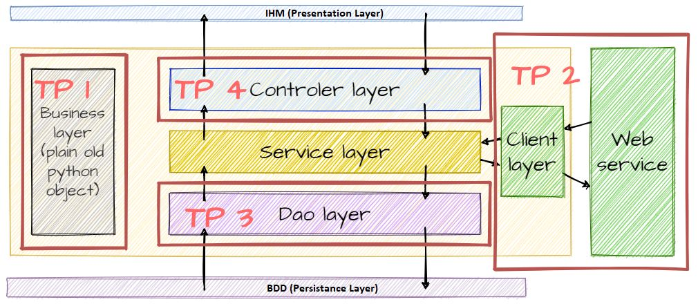
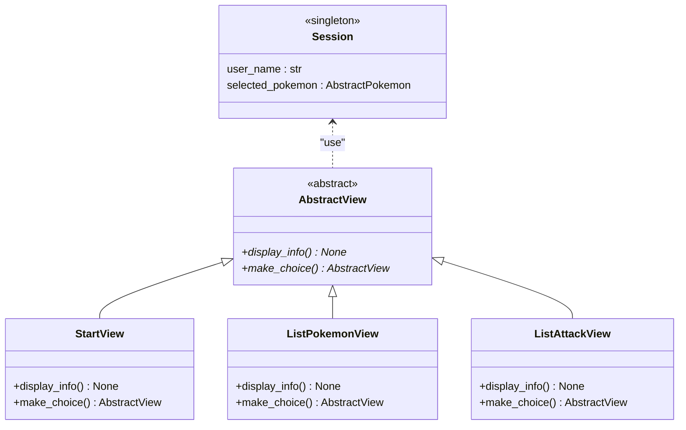

# TP 4 - Git et Création d'une IHM

> :scream: Comme vous pouvez le constater le sujet de ce TP est lui aussi long. Cela ne doit pas vous effrayer. Il mélange explications complètes et manipulations pour être au maximum autosuffisant. **Vous n'allez surement pas terminer le sujet, ce n'est pas grave. Il est là pour vous aider lors du projet informatique.**
>
> Ce TP mêle explications pour vous faire comprendre ce qui est fait, et phases de manipulation ou code. Ces phases sont appelées "**:writing_hand:Hands on**". C'est à ce moment-là que vous devez faire ce qui est écrit dans le TP. Les explications de ce TP ne doivent pas prendre le pas sur celles de votre intervenant. Prenez-les comme une base de connaissances pour plus tard, mais préférez toujours les explications orales.

Dans ce TP vous allez :

* Paramétrer Git
* Manipuler Git (en mode **terminal de commande**)
* Faire vos premières classes qui gèrent l'affichage

---

Les instructions de ce TP seront données pour une utilisation de **GitHub** comme dépôt distant. Si vous choisissez GitLab ou un autre hébergeur, à vous de vous adapter (les instructions devraient être assez ressemblantes).

## :arrow_forward: 0. Configuration de Git

Pour faire d'un seul coup la config Git et la création d'un clé ssh, vous pouvez utiliser les scripts présents sur la page Moodle du cours, onglet TP. Sinon cela se fait également très vite avec les commandes ci-dessous.

### :small_orange_diamond: Configurez Git

Ouvrez **Git Bash**, puis éxécutez les commandes suivantes en remplaçant les valeurs entre <>

* [ ] `git config --global user.name <prenom> <nom>`
* [ ] `git config --global user.email <mail_ensai>`
* [ ] `git config --global core.mergeoptions --no-edit`
* [ ] `git config --global core.editor "code -w"`
* [ ] `git config --global credential.helper store`
* [ ] pour vérifier les valeurs saisies : `git config -l` 

---

### :small_orange_diamond: Créez une clé ssh

Elle permettra de vous authentifier auprès de GitHub.
Dans **Git Bash** :

* [ ] `ssh-keygen -t rsa -b 2048 -N '' -q -f ~/.ssh/id_rsa`
* [ ] `mkdir /p/save` puis `cp -r ~/.ssh /p/save/.ssh` pour créer une sauvegarde de votre clé
  * Par défaut la clé est générée dans `C:/users/idxxxx/.ssh`
  * Si jamais cette clé venait à disparaitre, utilisez la sauvegarde pour la recopier dans `C:/users/idxxxx/.ssh`
* [ ] `cat ~/.ssh/id_rsa.pub | clip`
  * pour récupérer votre clé publique dans le presse papier
* [ ] Ouvrez un éditeur de texte et collez cette clé
  * gardez la de coté quelques minutes, vous allez devoir juste après coller cette clé dans GitHub

---

### :small_orange_diamond: Création de compte sur GitHub

* [ ] Créez un compte utilsateur
  * https://github.com/join
* [ ] Ajouter votre clé publique ssh sur GitHub ([lien direct](https://github.com/settings/ssh/new))
  * Cliquez sur votre icone profil en haut à droite
  * :gear: Settings
  * SSH and GPG keys
  * Cliquer sur le bouton **New SSH key**
    * Titre : `VM ENSAI` par exemple
    * Key : *Collez la clé publique* (contenu du fichier id_rsa.pub qui commence par **ssh-rsa** généré à l'étape précédente )

---

## :arrow_forward: 1. Travail en groupe 🧙‍♂️👩‍🔬🕵️‍♂️🦸‍♀️💻

:bulb: Avec vos camarades de projet, vous devez choisir un site qui va héberger votre code (GitHub, GitLab...). Il vous servira de dépôt commun (ou dépôt distant).

### :small_orange_diamond: Création d'un dépôt sur GitHub

* [ ] Repositories > New (ou [lien direct](https://github.com/new))
* [ ] Repository name : **ENSAI-2A-cinfo-TP4**
* [ ] Cliquez sur le bouton **Create new repository**

Pour le moment ce dépôt distant est vide

---

### :small_orange_diamond: Connecter ce dépôt avec un dépôt local

Dans les autres TP, vous aviez l'habitude de simplement cloner le dépôt distant du prof, faire les exercices et c'est tout.

Aujourd'hui, vous allez : 

* Cloner le dépôt distant
  * Pour créer votre dépôt local (jusque là, c'est toujours pareil)
* Connecter votre dépôt local à votre propre dépôt distant (celui que vous venez de créer)
* Interagir entre vos 2 dépôts (push, pull...)

---

* Créez un dossier puis importez le code du TP (branche tp4_base uniquement)
  * [ ] `mkdir -p /p/Cours2A/UE3_Complements_informatique/TP/TP4 && cd $_`
  * [ ] `git clone -b tp4_base --single-branch https://github.com/ludo2ne/ENSAI-2A-complement-info-TP.git`
* Modifiez le dépôt distant en déclarant le dépôt que vous avez créé juste avant
  * [ ] `cd ENSAI-2A-complement-info-TP` pour vous positionner dans le dépôt local Git
  * [ ] `git remote set-url origin git@github.com:<username_github>/ENSAI-2A-cinfo-TP4.git`
    * en remplaçant *<username_github>* par votre nom d'utilisateur GitHub
  * [ ] `git remote -v` pour vérifier que le dépôt distant a bien changé
* [ ] `git push` pour pousser votre code local vers le dépôt GitHub
  * Rafraîchissez la page GitHub pour vérifier

---

### :small_orange_diamond: Utilisation d'un seul dépôt par équipe

Maintenant vous allez **travailler en tant qu'équipe de projet**. Même si vous avez tous créé un dépôt git, un seul par groupe va être utilisé. Vous allez ainsi au sein d'une même équipe, récupérer le code de ce dépôt. 

:warning: Choisissez **LE** dépôt que vous allez utiliser (1 seul par équipe projet) et faîtes les actions suivantes uniquement sur ce dépôt.

* Sur la page GitHub du projet
    * Aller dans :gear: Settings > Collaborators
    * Cliquer sur le bouton **Add people**, puis recherchez et ajoutez vos camarades
* ou directement avec ce lien en remplaçant *<username_github>*
    * `https://github.com/<username_github>/ENSAI-2A-cinfo-TP4/settings/access`

---

### :small_orange_diamond: Import du dépôt commun pour les autres membres

Pour les autres, il vous faut maintenant tous récupérer le contenu du dépôt. Dans les commandes ci-dessous, remplacez **<username_github>** par le nom d'utilisateur de celui ou celle qui "possède" le dépôt commun.

* [ ] Allez sur la page GitHub du dépôt commun
    * https://github.com/<username_github>/ENSAI-2A-cinfo-TP4
* [ ] Cliquez sur le bouton **Code**
* [ ] Copiez le lien **Clone with SSH** qui ressemble à ceci : `git@github.com:<username_github>/ENSAI-2A-cinfo-TP4.git`
* Dans **Git Bash**, créez un nouveau dossier pour mettre votre dépôt local
    * [ ] `mkdir -p /p/Cours2A/UE3_Complements_informatique/TP/TP4/depot_commun && cd $_`
    * [ ] `git clone git@github.com:<username_github>/ENSAI-2A-cinfo-TP4.git`
    * Fermez Git Bash
* Ouvrez **Visual Studio Code**, puis ouvrez le dépôt commun
    * File > Open Folder
        * Allez dans `/p/Cours2A/UE3_Complements_informatique/TP/TP4/depot_commun`
        * cliquez une fois sur **ENSAI-2A-cinfo-TP4**
        * puis cliquez sur le bouton **Sélectionner un dossier**
    * Ouvrez un Terminal Git Bash dans VSCode (Terminal > New terminal)

---

#### :warning: Attention quand vous faites Open Folder dans VSCode

Le dossier parent de l'explorer de VSCode (à gauche) doit être : **ENSAI-2A-complement-info-TP**. 
Si c'est TP1, TP2, TP3, TP ou autre chose ce n'est pas bon ! Vous allez avoir des soucis d'imports par la suite.

---

## :arrow_forward: 2. Manipulations basiques avec git

**✍Hand on 1** Cette partie à pour but de vous faire essayer des commandes de bases de git.

* [ ] Créez dans votre dépôt local un fichier `hello_<prenom>.txt` qui contient par exemple `hello <prenom>`
* [ ] Dans le terminal, tapez la commande `git status` pour voir si votre fichier s'affiche
* [ ] Créez un fichier `hello_<prenom>.log` qui contient par exemple `aaaaa`
* [ ] Tapez `git status` pour voir si votre fichier s'affiche
    * :bulb: Normalement il ne s'affichera pas car si vous ouvrez le fichier `.gitignore`, vous remarquerez que tous les fichiers `*.log` sont ignorés par Git.
* [ ] Tapez `git add .` pour ajouter à la zone de transit (*stagging area*) tous les fichiers en attente 
* [ ] `git status` pour vérifier que votre fichier `hello_<prenom>` est prêt à être intégré au prochain commit
* [ ] Réalisez un commit `git commit -m "un super message de commit explicite"`
* [ ] Modifiez votre fichier `hello_<prenom>.txt` puis faites de nouveau les étapes précédentes (status, add, status, commit)
* [ ] Regardez votre historique avec un `git log --all --decorate --oneline --graph`
* [ ] Poussez vos modifications vers le dépôt commun avec un `git push`
    * Si quelqu'un a déjà poussé avant vous, vous allez obtenir un message proche de celui-ci
	```
	To https://github.com/ludo2ne/ENSAI-2A-complement-info-TP.git
	Merge branch 'main' of https://github.com/ludo2ne/ENSAI-2A-complement-info-TP
	 ! [rejected]        main -> main (fetch first)
	error: failed to push some refs to 'https://github.com/ludo2ne/ENSAI-2A-complement-info-TP.git'
	hint: Updates were rejected because the remote contains work that you do
	hint: not have locally. This is usually caused by another repository pushing
	hint: to the same ref. You may want to first merge the remote changes (e.g.,
	hint: 'git pull') before pushing again.
	hint: See the 'Note about fast-forwards' in 'git push --help' for details.
	```
* Dans ce cas, faites dans l'ordre 
    * [ ] `git pull` : pour mettre à jour votre dépôt local à partir du dépôt distant
    * [ ] `git push` : pour partager vos modifications faites en local vers le dépôt distant
* [ ] Une fois que tous les membres de l'équipe ont réussi à faire leur **push**, faites tous un `git pull` pour avoir chacun des dépôts identiques.

## :arrow_forward: 3. Gérer un conflit avec git

### :small_orange_diamond: Définition

Un conflit apparait lorsque 2 versions s'affrontent et que Git ne peut pas savoir laquelle est la bonne.

Exemple : 
Un dépôt commun contient un seul fichier `hello.txt` qui contient **hello world**

* Alice et Bob clonent ce dépôt
* En local Alice modifie le contenu du fichier en `hello Alice` et fait un **add** puis **commit**
* Bob fait de même en saisissant `hello Bob`
* Alice fait un **push** et met à jour le dépôt commun
* Bob fait un **push** et échoue. Git dit que son dépôt local n'est pas à jour
* Bob fait donc un **pull** pour mettre à jour son dépôt local. C'est à ce moment que le conflit apparait.
    * Bob voulais modifier le contenu du fichier en `Hello Bob` alors qu'Alice a déjà modifié en `Hello Alice`
	```
	<<<<<<< HEAD
	Hello Bob           (Votre modification - current change)
	=======
	Hello Alice         (La modification du dépôt distant - incoming change)
	>>>>>>>
	```
* Bob doit maintenant décider quelle version il souhaite garder
* Bob choisit `Hello Bob`, fait un add, commit, push et c'est terminé

---

### :small_orange_diamond: Résolvez vos conflits

**✍Hand on 2** Maintenant vous allez essayer de créer, puis résoudre un conflit !

* [ ] Choisissez un fichier commun dont vous allez tous modifier le contenu
* [ ] Modifiez chacun de votre coté (sur vos dépôt locaux) ce fichier
* [ ] Poussez votre code

La première personne à pousser ne devrait pas avoir de conflit, les autres oui.
Recommencez la procédure ci-dessus avec un autre fichier pour que tout le monde expérimente la résolution de conflits.

Lorsque vous avez un conflit à gérer : 

* [ ] Corrigez à la main le fichier 
    * par exemple en imposant votre modification
    * et en supprimant les `=======` et les `>>>>>>>`
* [ ] `git add .` puis `git commit -m "mon super message" && git push`


En conclusion, avoir des conflits n'est pas grave même si c'est un peu pénible à résoudre. Pour essayer d'éviter les conflits : 

* faites des `pull` et `push` réguliers
* essayez de travailler en équipe mais sur des fichiers différents

---

## :arrow_forward:  3. Bilan des trois premiers TP 

Si l'on reprend le modèle en couches présenté en cours, voici ce que l'on a fait depuis le début des TP :



### :small_orange_diamond: La couche service

Actuellement notre couche service est bien maigre. En effet notre application n'a aucune logique métier. On a bien des objets métiers que l'on persiste mais aucune réelle application derrière. La raison à ce manque provient du fait que cette couche est la partie la plus longue à développer car elle contient la logique métier de l'application. 

Et le but de ces TP n'est pas de vous montrer comment faire une petit application type jeu Pokémon en console. Ils ont pour vocations à vous montrer une architecture de base en couche et vous présenter comment la réaliser. Dans votre projet, il est possible que ce soit la couche service qui vous demande le plus de travail.

---

### :small_orange_diamond: La couche contrôleur

La notion de contrôleur apparait avec le design pattern *MVC* ([Model-View-Controler](https://fr.wikipedia.org/wiki/Mod%C3%A8le-vue-contr%C3%B4leur)). Mais c'est un patron de conception beaucoup trop complexe pour faire un simple affichage en console. 

À la place vous allez utiliser le patron *Model-View-Presenter* qui est plus simple car il reprend le principe de couches qui se succèdent.

Il n'y aura donc pas de couche **Controleur** mais une couche **View** qui fera office d'IHM et appelera directement les services nécessaires.

---

### :small_orange_diamond: La couche view

Le fonctionnement est le suivant lorsque vous lancez l'application : 

* vous arrivez sur une vue d'accueil qui propose différents choix
* selon le choix, zéro, un ou plusieurs services sont appelés
* puis vous arrivez vers une nouvelle vue (ou éventuellement resterez sur la même)

Exemple : 

* Vous êtes sur la **Vue d'accueil** et vous sélectionner `se connecter`
* Vous basculez vers la **Vue de connexion**
    * dans cette vue, on vous demande de saisir user et password
    * une fois la saisie terminée, le **Service des utilisateur** va être appelé
    * ce service a une méthode `verification_connexion()`
        * cette méthode va appeler la **DAO Utilisateur** pour vérifier que l'utilisateur et son mot de passe existent bien en base de données
* si la vérification est ok, vous basculez vers la **Vue Menu utilisateur** où va par exemple s'afficher la liste des actions autorisées
* ...

---

## :arrow_forward: 4. Une session pour les gouverner toutes

Là vous pouvez vous dire : 

* ok on va se balader de vues en vues, ça ça va
* mais imaginons l'exemple suivant :
    * on passe par la **Vue de connexion** et on se connecte avec l'utilisateur Michel
    * on arrive sur la **Vue Menu utilisateur** et on se balade dans les différentes vues
    * un peu plus tard, on arrive sur la **Vue d'ajout de Pokemon**, on sélectionne celui qui nous plait et on valide
    * cela va aboutir à l'appel d'une méthode **DAO** du type `ajouter_pokemon(utilisateur, pokemon)`
    * Cette méthode a 2 arguments
        * pokemon : ok facile à récupérer, on vient juste avant de le sélectionner
        * utilisateur : là c'est moins facile car la dernière fois qu'on avait l'objet utilisateur à portée c'était dans la Vue de connexion
* Est-ce que une fois connecté, on doit passer l'utilisateur en paramètre de toutes les méthodes que l'on va appeler ?
    * Heureusement NON, ce serait trop compliqué
    * :bulb: c'est ici que l'objet **Session** va nous être utile

Dans notre **Session**, nous allons pouvoir stocker des objets utiles, par exemple l'utilisateur actif. 

Ainsi, une fois connecté, on stocke l'utilisateur en session et on peut se servir de cet objet à tout moment !

Voici les liens entre notre `Session` et nos `Views` :



Toute nos `Views` vont hériter de la classe `AbstractView`. Cette classe va contenir deux méthodes abstraites :

- `display_info()` : qui va juste déterminer l'affichage en console
- `make_choice()` : qui va gérer les choix de l'utilisateur et l'envoyer vers une autre page.

En plus de cela nous allons gérer tous les attributs utilisés par les `View` dans un objet `Session` qui sera un singleton ce qui nous assurera que chaque accès à cet objet retourne la même instance et donc les mêmes valeurs stockées.

Cette architecture vous permet de séparer vos différents menu en fichiers séparés et d'avoir un fonctionnement simple car chaque menu retourne un autre menu simplement.

:warning: La création de vos menus peut générer des problèmes de dépendances circulaires. En effet si la page A envoie sur la page B et la page B envoie sur la page A, en fonction de la façon dont vous gérez vos imports vous allez voir un problème de dépendances circulaires. Quand le problème se présentera voici 2 solutions possibles : 

* remplacer `from X import Y` en `import Y as name`
* déplacer vos imports dans la fonction qui en a besoin

## :arrow_forward: 5. InquirerPy 

Pour nous faciliter la gestion de la console nous allons utiliser la bibliothèque python [InquirerPy](https://inquirerpy.readthedocs.io/en/latest/). Elle permet de créer facilement des applications interactives en console. Le projet est bien documenté avec plusieurs [exemples](https://github.com/kazhala/InquirerPy/tree/master/examples) de code, faciles à transposer.

* [ ] Lancez le `__main__.py` et testez un peu l'application
* [ ] Regardez les fichiers du package **view** pour essayer de comprendre comment fonctionnent les vues. Le principe est toujours le même lorsque l'on arrive sur une nouvelle vue : 
    * on répond aux questions demandées
    * un traitement est éventuellement fait (appel à des services)
    * on bascule vers une autre vue


### :small_orange_diamond: Mes premières `View`

**✍Hand on 3**

Répartissez vous le travail entre membre du groupe pour implémenter les `Views` suivantes :

* Affichage Pokémon:
  * [ ] `PokemonListView` : qui permet de visualiser 30 Pokémons sommairement. Il est possible de sélectionner un pokémon pour aller sur `PokemonDetailsView`.  Vous pouvez permettre un retour arrière sur la `StartView` si vous le souhaitez.
  * [ ] `PokemonDetailsView` : qui affiche les détails du Pokémon sélectionné comme ses statistiques et ses attaques. Renvoie sur la `StartView` ou `PokemonListeView` en fonction du choix de l'utilisateur.
* Affichage attaque:
  * [ ] `AttackListView` :  qui permet de visualiser 50 attaques sommairement et d'en sélectionner une pour aller sur `AttackDetailsView`.  Vous pouvez permettre un retour arrière sur la `StartView`.
  * [ ] `AttackDetailsView` : qui affiche les détails de l'attaque sélectionnée, comme par exemple ses caractéristiques (name, power, description), mais également quels sont les Pokémons qui peuvent l'apprendre. Renvoie sur la `StartView` ou `AttackListView` en fonction du choix de l'utilisateur.
* [ ] `CreatePokemonView` : qui permet de créer un Pokémon et le mettre en session. Après validation de l'utilisateur on retourne sur `StartView`


Quelques astuces :

- `PokemonService` dispose d'une méthode `get_pokemon_from_webservice(limit:int, offset:int)` pour récupérer des pokémons de la base
- `AttackService` dispose d'une méthode `get_attacks_from_webservice(limit:int, offset:int)` pour récupérer des attaques de la base
- de nombreux exemples sont disponibles sur la [doc InquirerPy](https://inquirerpy.readthedocs.io/en/latest/pages/prompts/list.html)


Quand vous avez terminé une classe, faites un commit, puis poussez sur le dépôt distant.

---

Merci d'avoir participé et Vive les Pokemons !