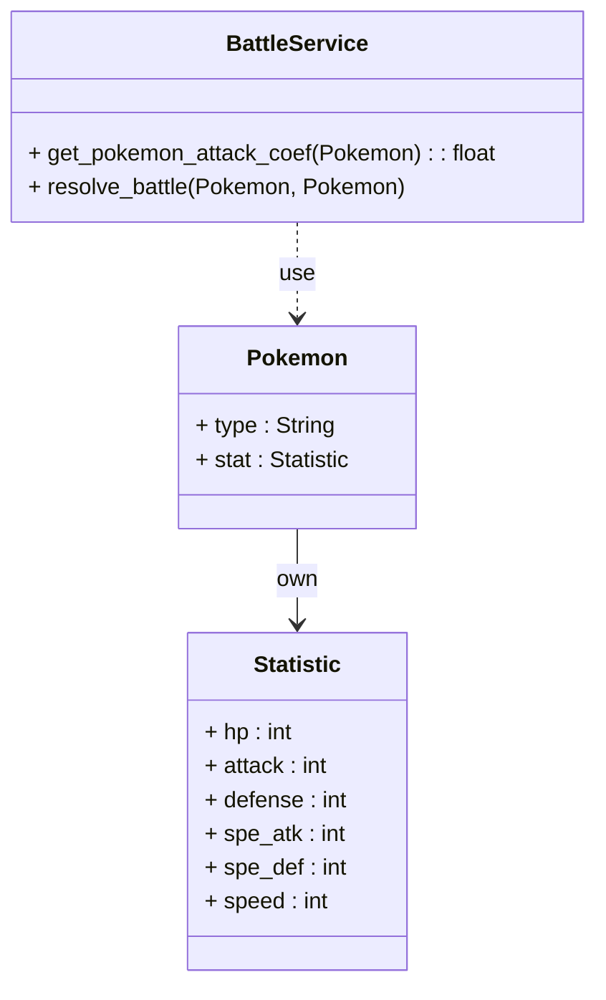
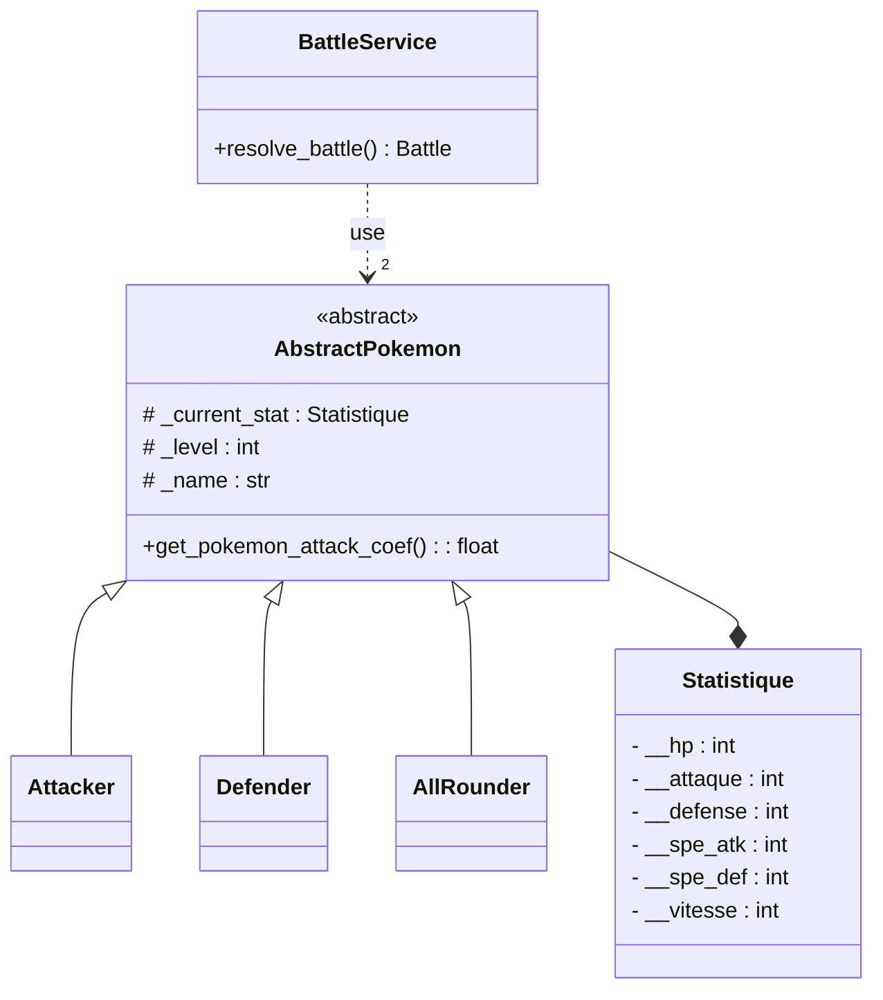
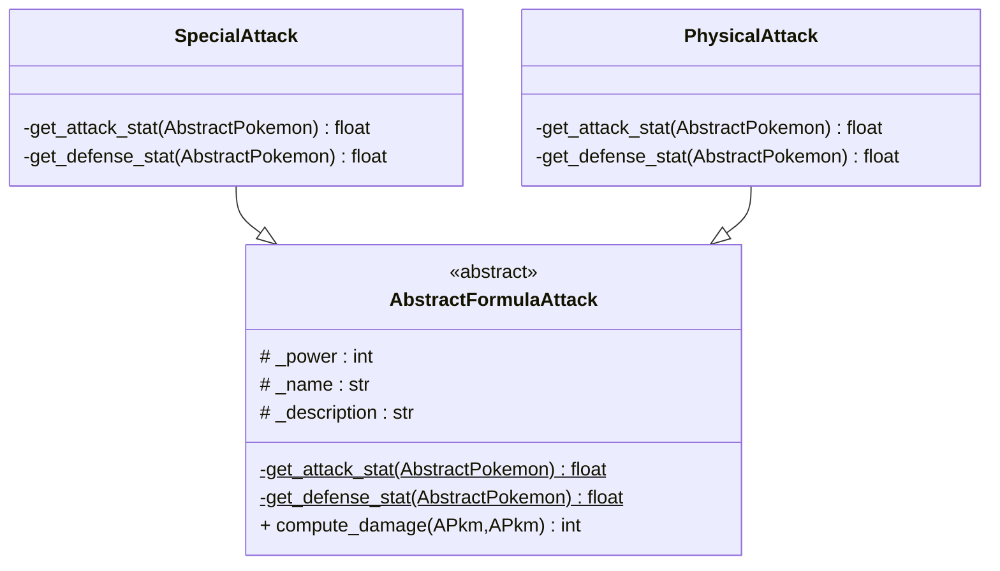
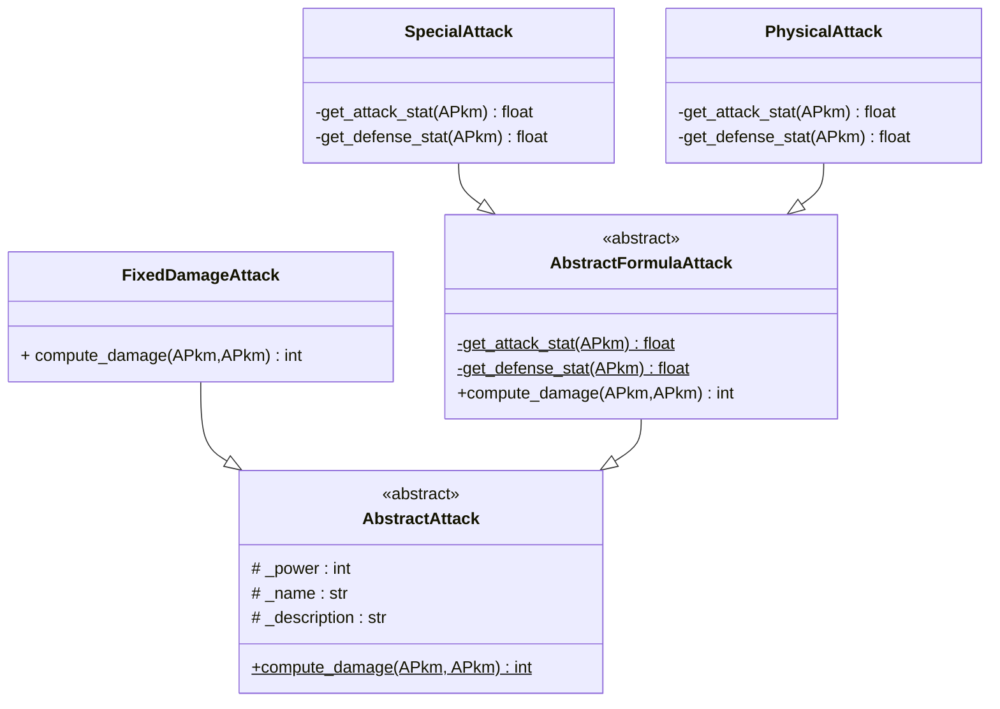
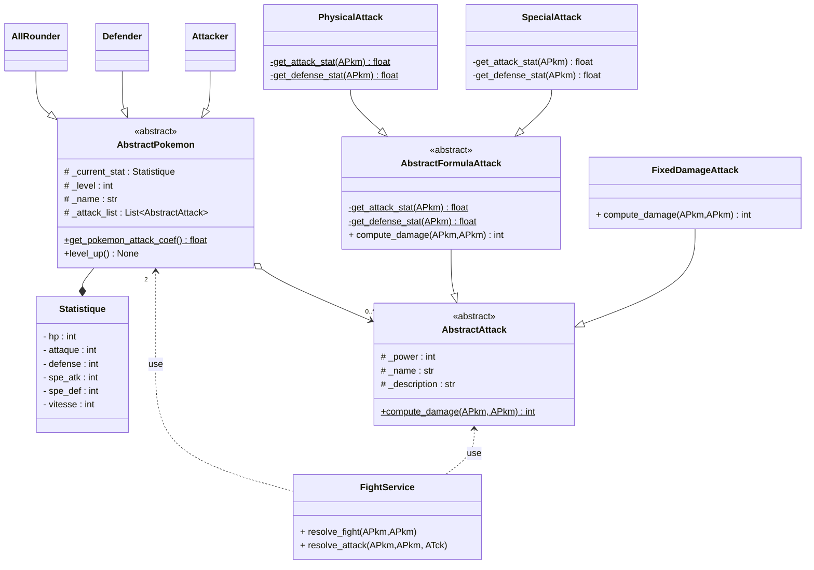

# TP 1 : Retour sur la POO, objets métier et patron de conception *strategy*

## :arrow_forward: 0. Avant de commencer

Ce TP mêle explications et phases de code.  
Ces phases de code sont appelées "**✍Hands on**", c'est à ce moment là que vous devez écrire du code.

Les explications de ce TP ne doivent pas prendre le pas sur celles de votre intervenant. Prenez les comme une base de connaissance pour plus tard, mais préférez toujours les explications orales.

---

## :arrow_forward: 1. Introduction et mise en place

Vous allez créer les **objets métier** pour un jeu *Pokémons*.  
Un objet métier représente un concept que notre application va manipuler. Il représente dans votre code quelque chose de concret, qui modèlise la réalité.

> **Objet métier (business object)** : représentation informatique d'un objet "réel" que notre programme va manipuler pour répondre à un besoin. Dans le cas de notre application cela sera des *Pokémons*, des attaques ou des objets.  
>
> Dans une application de e-commerce par exemple, les articles et comptes sont des objets métier. Ils permettent de séparer les données de l'application et les traitements. Cela conduit à avoir des objets contenant essentiellement des attributs et très peu de méthodes autre que des *getter* et *setter*.

Ce TP sera réalisé avec l'IDE (**I**ntegred **D**evelopment **E**nvironment) `Visual Studio Code`.

### :small_orange_diamond: Importez le code du TP

* Ouvrez `Git Bash`
* Créez un dossier pour stocker le code du TP
  * `mkdir -p /p/Cours2A/UE3_Complements_informatique/TP/TP1 && cd $_`
* Clonez le dépôt
  * `git clone TODO`
* Ouvrez `Visual Studio Code`
  * File > Open Folder
  * TODO
  * Ouvrez un terminal dans VSCode (CTRL + ù)
  * listez les branches `git branch -a`

---

## :arrow_forward: 2. Modélisation et implémentation

Avant d'écrire du code, nous allons réfléchir à la meilleure conception possible pour réaliser nos `Pokémons`. Notre conception essayera au maximum de respecter la règle suivante : **faible couplage, forte cohésion**.  

En d'autre termes nous allons essayer de faire :

* des classes **les plus disjointes possible** (*faible couplage*) pour qu'une modification dans une classe ne nous demande pas de modifier les autres
* tout en essayant d'avoir **les tâches réalisées par une seule classe les plus liées possible** (*forte cohésion*).

> Notre jeu s'inspirera de *Pokémon Unite* (aucune connaissance du jeu, ni de *Pokémon* n'est nécessaire).  
> Dans un premier temps, nous allons faire affronter 2 Pokémons.  
> Chaque Pokémon sera défini par :
>
> * des statistiques
>   * hp : health point
>   * attack, defense, speed... : qui serviront déterminer la force de ses attaques
> * un type : [Attacker, Defender, All Rounder, Speedster, Supporter](https://www.nationhive.com/fr/jeux/pokemon-unite/guide/roles-des-pokemon)
>   * selon le type, la force de l'attaque dépendra de telle ou telle statistique

### :small_orange_diamond: Première approche : le « `if/elif/else` » :skull

Imaginons que nous créions les 3 classes suivantes avec le **type** comme attribut de `Pokemon`. Pour calculer la puissance d'une attaque, voici comment nous devrions nous y prendre :



```python
class BattleService:
    def get_pokemon_attack_coef(pokemon : Pokemon) -> float :
        if pokemon.type == "Attacker":
            multiplier = 1 + (pokemon.stat.speed + pokemon.stat.attack) / 200
        elif pokemon.type == "Defender":
            multiplier = 1 + (pokemon.stat.attack + self.defense_current) / 200
        elif pokemon.type == "All rounder":
            multiplier = 1 + (pokemon.stat.sp_atk + pokemon.stat.sp_def) / 200
        elif pokemon.type == "Speedster":
            multiplier = 1 + (pokemon.stat.speed + pokemon.stat.sp_atk) / 200
        elif pokemon.type == "Supporter":
            multiplier = 1 + (pokemon.stat.sp_atk + pokemon.stat.defense) / 200
        return multiplier
```

> **Question 1 :** Expliquez pourquoi une implémentation à base de `if/elif/else` pour les rôles est une mauvaise idée ? Imaginez s'il y avait plusieurs blocs de code similaires dans notre application, et que nous devions ajouter un nouveau type.

---

### :small_orange_diamond: La puissance de la POO

Au lieu d'externaliser les comportements de nos *Pokémons*, nous allons mettre tous leurs comportements spécifiques dans des classes filles d'une super classe `Pokemon`. Ceci est rendu possible grâce à deux propriétés des objets en POO :

* **héritage** : il est possible de spécialiser une classe existante en modifiant son comportement, ou en ajoutant de nouveaux
* **polymorphisme** : deux fonctions peuvent avoir le même nom mais avoir des comportements différents

En plus, comme chacun de nos *Pokémons* va forcement être d'un type, aucun ne sera simplement de la classe `Pokemon`, cela nous permet de rendre cette classe *abstraite*. En définissant clairement notre classe abstraite nous allons avoir :

* Un plan pour toutes les classes qui en héritent. Cela à pour avantages de :
  * Donner des informations sur la structuration du code  
  * Permettre de générer automatiquement les méthodes à définir
  * Limiter les bug. Si on oublie une méthode, le code plante au démarrage, ce qui évite des comportements non prévus difficile à détecter
* Une **interface** unique pour tous les types de *Pokémons*. Quelque soit le type du *Pokémon*, il sera considéré comme un `AbstractPokemon` partout dans le code. Cette unicité rend le code plus facile à écrire.

---

### :small_orange_diamond: Un peu de code

* [ ] **✍Hands-on 1** : Implémentez les classes pythons dans le package `business_object/pokemon` en respectant le diagramme UML ci-dessous composé des classes suivantes :

* `BattleService` : comporte une méthode pour faire s'affronter 2 Pokemons
* `AbstractPokemon` : représente un Pokemon
  * dispose de 3 attirbuts *Protected*
  * d'un constructeur qui initialise la valeur de ces 3 attributs
  * et de la méthode abstraite `get_pokemon_attack_coef()` qui sera spécifiée dans les classes filles
* `Attacker`, `Defender` et `AllRounder` héritent de `AbstractPokemon`
  * définissent la méthode `get_pokemon_attack_coef()`



Reprenez les formules de la **✍Question 1** pour calculer les coefficients d'attaque.

Pour faire une classe abstraite, utilisez le package `abc`.  
Voici un exemple de classe abstraite (ne copiez/collez pas ce code !):

```python
# Fichier abstract_personnage.py
from abc import ABC, abstractmethod

class AbstractPersonnage(ABC):
    def __init__(self, phrase_attaque:str, phrase_defense:str) -> None:
        self._phrase_attaque = phrase_attaque
        self._phrase_defense = phrase_defense
       
    @abstractmethod # décorateur qui définit une méthode comme abstraite
    def degat_attaque(self) -> int:
     pass

# Fichier magicien.py
from abstract_personnage import AbstractPersonnage
class Magicien(AbstractPersonnage):
    def __init__(self) -> None:
        super().__init__("Lance une boule de feu","Utilise une barrière magique" )
       
    def degat_attaque(self) -> int:
        # code pour calculer les dégâts
        return 10
```

Vous devrez arriver à une arborescence proche de celle-ci à la fin de cette session de code :

```
📦pokemon_unite_lite
 ┣ 📂business_object
 ┃ ┣ 📂pokemon
 ┃ ┃ ┣ 📜abstract_pokemon.py
 ┃ ┃ ┣ 📜attacker.py
 ┃ ┃ ┣ 📜defender.py
 ┃ ┃ ┗ 📜all_rounder.py
 ┃ ┗ 📜 statistique.py
 ┗ 📂service
   ┗ 📜battle_service.py
```

---

### :small_orange_diamond: Testez votre code

* [ ] **✍Hands-on 2**

Pour cela vous allez utiliser le package `unittest` de python (doc [ici](https://docs.python.org/3/library/unittest.html)). Ce package permet de réaliser des tests unitaires dans des classes séparées. L'avantage par rapport à `doctest`, c'est que les tests ne "polluent" pas vos classes, et qu'il est possible de *patcher* certains comportements des classes. Vous allez faire un dossier test à la racine du projet où vous allez y mettre vos tests en reproduisant l'architecture de votre application, en ce concentrant pour le moment sur la partie "*Pokémon*".

```
📦pokemon_unite_lite
 ┣ 📂business_object
 ┃ ┣ 📂pokemon
 ┃ ┃ ┣ 📜abstract_pokemon.py
 ┃ ┃ ┣ 📜attacker.py
 ┃ ┃ ┣ 📜defender.py
 ┃ ┃ ┗ 📜all_rounder.py
 ┃ ┗ 📜 statistique.py
 ┣ 📂service
 ┃ ┗ 📜battle_service.py
 ┗ 📂test
  ┗ 📂test_business_object
      ┗ 📂test_pokemon
        ┣ 📜abstract_pokemon_test.py
        ┣ 📜attacker_test.py
        ┣ 📜defender_test.py
        ┗ 📜all_rounder_test.py
```

Voici un exemple de test avec le module `unittest` de python :

```python
from unittest import TestCase

from business_object.pokemon.defender_pokemon import DefenderPokemon
from business_object.statistic import Statistic


class TestDefenderPokemon(TestCase):
    def test_get_coef_damage_type(self):
        # GIVEN (ce qui sert à initialiser le test)
        attack = 100
        defense = 100
        snorlax = DefenderPokemon(stat_current=Statistic(
            attack=attack,
            defense=defense
        ))

        # WHEN (la méthode à tester)
        multiplier = snorlax.get_pokemon_attack_coef()

        # THEN (vérification que la méthode retourne le bon résultat)
        self.assertEqual(2, multiplier)
```

**Question 2** : Pouvez-vous tester la méthode `level_up()` directement sur un `AbstractPokemon` ? Avez vous une idée comment faire ?

---

## :arrow_forward: L'agrégation, l'autre façon d'ajouter de la souplesse dans le code

Maintenant que nos *Pokémons* sont faits, nous allons y ajouter les attaques. Notre système va devoir respecter certaines contraintes :

* Plusieurs types d'attaque vont devoir coexister, chacune avec un mode de calcul de dégâts différent, à minima nous allons avoir :
  * Des attaques "normales" qui utilisent l'attaque et la défense des pokémons ;
  * Des attaques "spéciales" qui utilisent l'attaque spé et la défense spé des pokémons ;
  * Des attaques à dégâts fixe qui font un nombre fixe de dégât.
* Un pokémon peut avoir plusieurs attaques et le type de l'attaque doit être transparent pour le pokémon.

### Types d'attaques

#### Attaque à dégâts variables

Les attaques à dégâts variables vont utiliser la formule classique dégât de pokémon :
$$
Damage = \big ( \frac{(\frac{2*Level}{5}+2)* Power *Att}{Def*50} +2\big) *random* other\_multipliers
$$
avec $Att$​ et $Def$​​ pouvant valoir l'attaque ou l'attaque spé et défense ou défense spé, $Power$​ la valeur de puissance de l'attaque, $random$​​ une valeur comprise dans l'intervalle [0.85; 1] et $other\_multipliers$​​ tous les autres multiplicateurs possible, comme le coefficient d'attaque des pokémons.

Comme nous souhaitons juste modifier 2 facteurs de notre attaque, sans modifier la formule général, nous allons utiliser le patron de conception *template method*, dont voici la modélisation UML dans notre cas :



La classe `AbstractFormulaAttack` va contenir :

* la méthode concrète (en opposition à abstraite) `compute_damage(pkmon_attacker: AbstratPokemon, pkmon_targeted: AbstractPokemon)` . Cette méthode va contenir la formule de calcul des dégâts, mais en appelant les méthodes  `get_attaque_stat(AbstratPokemon)` et `get_defense_stat(AbstratPokemon)` pour savoir quelle statistique utiliser
* les méthodes abstraites `get_attack_stat(AbstratPokemon)` et `get_defense_stat(AbstratPokemon)`. Ces méthodes devront être implémentées dans les classes filles pour déterminer quelles statistiques utiliser.

Pour simplifier le code va ressembler à cela *(ce code est uniquement là pour vous donner un exemple !!!!)* :

```python
# abstract_formula_attck.py
from abc import ABC
class AbstractFormulaAttack(ABC):
 def __init__(power: int, name:str, description: str):
  self._power: int = power
  self._name: str = name
  self._description: str = description
 
 def compute_damage(pkmon_attacker : AbstractPokemon, pkmon_targeted : AbstractPokemon):
        damage = self._power * self.get_attack_stat(pkmon_attacker)/self.get_defense_stat(pkmon_targeted) #ceci n'est pas la bonne formule
        return damage
    
    @abstractmethod
    def get_attack_stat(pkmon_attacker: AbstractPokemon):
        pass
    
    @abstractmethod
    def get_defense_stat(pkmon_targeted: AbstractPokemon):
        pass
    
# physical_attack.py
from business_object.pokemon.abstract_pokemon import AbastractPokemon
class PhysicalAttack(AbstractFormulaAttack):
    def get_attack_stat(pkmon_attacker: AbstractPokemon):
        return pkmon_attacker.current_attack
    

    def get_defense_stat(defender: pkmon_targeted):
        return pkmon_targeted.current_defense

# special_attack.py
from business_object.pokemon.abstract_pokemon import AbastractPokemon
class SpecialAttack(AbstractFormulaAttack):
    def get_attack_stat(pkmon_attacker: AbstractPokemon):
        return pkmon_attacker.current_spe_atk
    

    def get_defense_stat(pkmon_targeted: AbstractPokemon):
        return pkmon_targeted.current_spe_def
```

#### ✍Hands on 3 : attaques à dégâts variables

Implémenter les 3 classes ci-dessus et créez des tests pour vérifier que tout fonctionne correctement

#### Attaques à dégâts fixes

Maintenant nous allons faire des attaques à dégâts fixes. Ces attaques ont un comportement très différents de nos attaques déjà faites, donc les faire hériter de `AbstractFormulaAttack` n'aurait pas de sens. À la place nous allons faire un autre niveau d'héritage



La méthode `compute_damage`de la nouvelle classe `FixedDamageAttack` retournera juste la puissance (*power*) de l'attaque.

#### ✍Hands-on 4 : attaques à dégâts fixes

Implémentez les 2 nouvelle classes et créez des tests pour vérifier que tout fonctionne correctement

### Architecture finale (bonus, si vous avez le temps)

Nous allons maintenant rattacher les bouts pour créer notre architecture finale :



Cette architecture permet de décorréler les attaques des pokémons et de spécifier le comportement des attaques au fur et à mesure des héritages. Les avantages sont :

* Pour la classe `AbstractPokemon`, toutes les attaques sont des `AbstractAttack`. Tant qu'elles exposent la méthode `compute_damage` notre programme va fonctionner. On peut ainsi facilement ajouter de nouveau type d'attaque sans problème.
* Un *Pokémon* peut avoir des attaques de tous les types sans difficultés
* Nous pouvons ajouter un système d'état comme la paralysie ou le poison assez facilement. Il faut pour cela modifier la classe `AbstractAttack` et les classes qui en héritent. Cela sera potentiellement long, mais ne demande pas de toucher à la partie "*Pokémon*" de notre architecture.
* Une personne pourrait se concentrer sur la création des *Pokémons* alors qu'une autre pourrait se concentrer sur celles des attaques sans difficulté. Les deux parties du code sont relativement indépendante, la seule zone de couplage sont les classes `AbstractPokemon` et `AbstractAttack`, qui servent avant tous à définir ce qui doit être fait par les classes filles et ce qui est accessible à l'extérieur. **Ainsi tant que chaque personne implémente ce qui doit l'être dans sa partie et n'appelle que les méthodes abstraites publiques, la développement de l'application se passera dans de bonne condition.**

Le fait d'externaliser le comportement des attaques dans des classes spécifiques puis de les lier aux Pokémon via une relation d'agrégation assez souple qui permet de changer dynamiquement les attaques d'un Pokémon est le patron de conception *strategy*.

#### ✍Hands-on 5 : Let's code

Implémentez le diagramme de classe ci-dessus et testez votre code en écrivant de nouveaux tests unitaires.

```
<style>
  body{
    text-align: justify
  }
</style>
```
